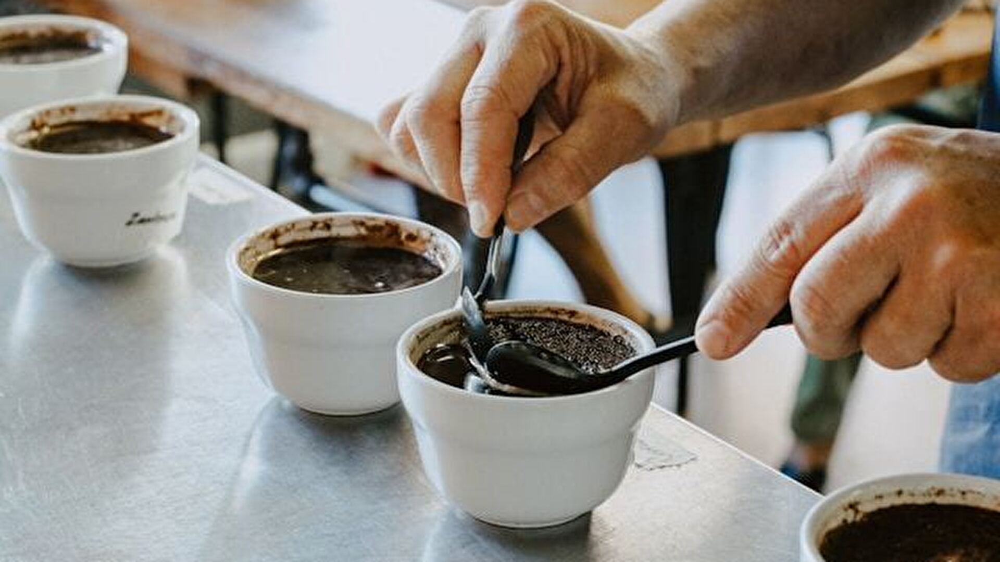

## Application Overview
This is a web application service for conducting quality evaluations through coffee cupping. Users can review their cupping history, freeing themselves from the struggles of paper-based management.

## Coffee Cupping App

Cupping is a globally recognized method for objectively evaluating the quality of coffee. It allows for the assessment of both the quality of green beans and the roasting process, thereby facilitating approaches to enhance coffee bean quality. Cupping involves comparing the flavors and characteristics of coffee from different origins and processing methods, providing valuable information for producers and roasters to work on quality improvement. It also serves as a guide for consumers in selecting coffee that suits their preferences and needs. Cupping plays a crucial role in promoting quality control and improvement in the coffee industry, supporting sustainable growth.

## Reason for Creating the Cupping App

The technique of cupping is becoming a standard practice among baristas in the coffee industry. Furthermore, specialized world championships dedicated to cupping are now being held, establishing the importance of this technique in evaluating coffee quality. Feeling the necessity to transition from inefficient paper-based cupping forms to web-based platforms, I have embarked on creating a cupping application tailored for consumers. By doing so, I aim to democratize cupping techniques, which were previously primarily available for businesses, making it accessible to anyone interested in coffee
With the widespread adoption of this application, I am confident that it will increase interest in coffee quality, leading to overall improvement in the quality of coffee within the industry. Ultimately, I believe it will contribute to the enhancement of profits and living standards for coffee farms and stakeholders.

## Technology Stack
### Frontend
- **Next.js**: React framework for server-side rendered and static web applications.
- **Typescript**: Superset of JavaScript with static typing for improved code quality.
- **TailwindCSS**: Utility-first CSS framework for rapid UI development.
- **Storybook**: Tool for developing UI components in isolation.

### Testing
- **Jest**: JavaScript testing framework for unit testing.
- **React Testing Library**: Testing utility for testing React components.

### Backend & Database
- **Next-auth**: Authentication library for Next.js applications.
- **Supabase**: Open-source Firebase alternative with a suite of backend tools.
- **Prisma**: ORM tool for Node.js and TypeScript.
- **PostgreSQL**: Powerful open-source relational database management system.

### Deployment & CI/CD
- **GitHub Actions**: Continuous integration and deployment workflow automation.
- **Vercel**: Platform for deploying web applications.

## Product
- [Application Link](https://coppi.vercel.app/)
## Manual
- [Docs](https://ko-hi-san.notion.site/Cupping-App-Documentation-100b8e1cb91547089d0b37b9a02badab?pvs=4)

- [Figma Design](https://www.figma.com/file/6kzvtit0ez6ZIMHCMrBZ7e/Design?type=design&node-id=0%3A1&mode=design&t=p42RhGSb196wqjx8-1)

## ~~ Japanese Below ~~
## アプリケーション概要
コーヒーカッピングという品質評価を行うためのWEBアプリケーションサービスです。
これまでのカッピング履歴を確認でき、これまでの紙で管理していた苦労から解放されます。

## コーヒーカッピングとは
カッピングは、コーヒーの品質を客観的に評価するための世界標準の手法です。生豆品質や焙煎品質を評価することで、コーヒー豆の品質向上につながります。カッピングは、異なる産地や処理方法によるコーヒーの風味や特性を比較し、生産者や焙煎業者が品質改善に取り組むための情報を提供します。また、消費者にとっても、好みやニーズに合ったコーヒーを選択する際の指標となります。カッピングは、コーヒー産業において品質管理と向上を促進し、持続可能な成長を支える重要な手法です。

## なぜカッピングアプリを制作するのか
カッピングという技術は、現在、コーヒー業界で働くバリスタの間で標準的な手法となりつつあります。さらに、現在では、カッピングに特化した世界大会も開催され、この技術の重要性がコーヒーの品質評価において確立されています。非効率な紙ベースのカッピングフォームをWEBベースに移行していくことの必要性を感じており、toC向けのカッピングアプリケーションの制作によって、これまでtoB向けにしか提供されておらず普及しづらかったカッピング技術をより一般化し、コーヒーに関心のあるすべての人がカッピングを容易に行うことができるようになります。

このアプリケーションの普及により、コーヒーの品質に対する関心が高まり、業界全体のコーヒーの品質向上につながると確信しています。最終的には、コーヒー農園やコーヒー関係者の利益向上や生活水準向上に貢献することができると考えています。
